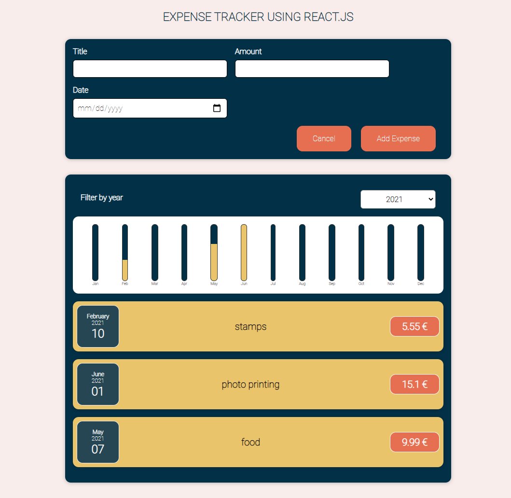

<h1 style="text-align: center;">React.js Expense Tracker</h1>

This is an expenses tracker using React.js, done as a code-along with Maximilian Schwarzmüller on his [Udemy web course](https://www.udemy.com/course/react-the-complete-guide-incl-redux/).

<br/>
<div align="center">
  
</div>
<br/>
<br/>



<p text-align="justify">This simple application allows the addition of new expenses with a title, amount and date, and tracking of those expenses. They'll be rendered in the component below according to the year selected in the dropdown menu. Besides that, it also has a chart to show visually the amount spent in specific months compared to others based on that years highest expense.</p>
<br/>
To try this out, just download this repository, open your terminal inside the desired location and simply run:

<br/>

```
npm install
npm start
```

Here's [Maximilian's Github page](https://github.com/maxschwarzmueller).

---------------------------------------------------------------
